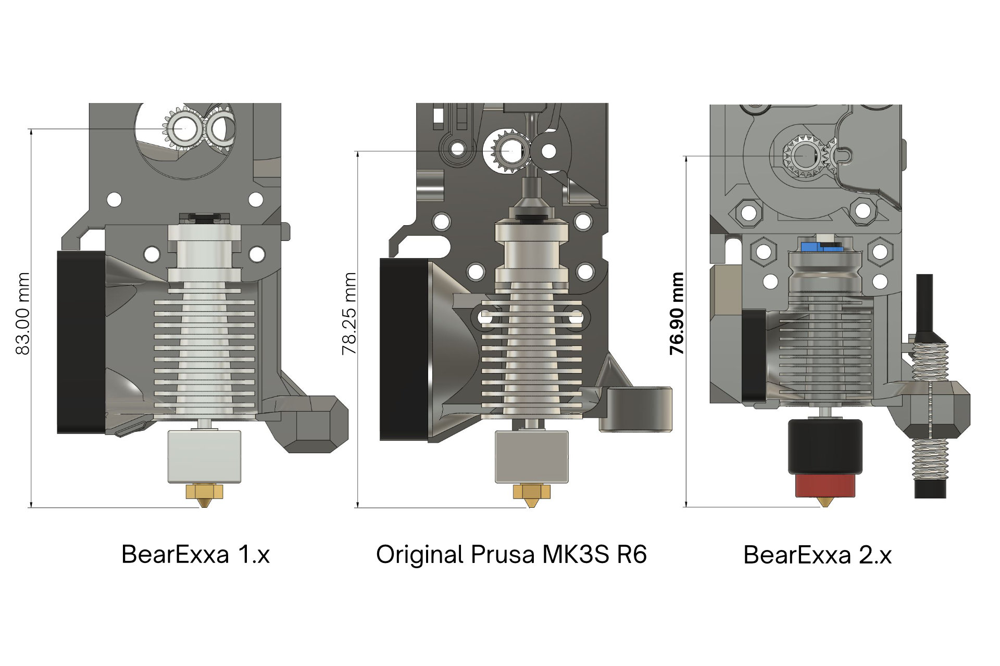
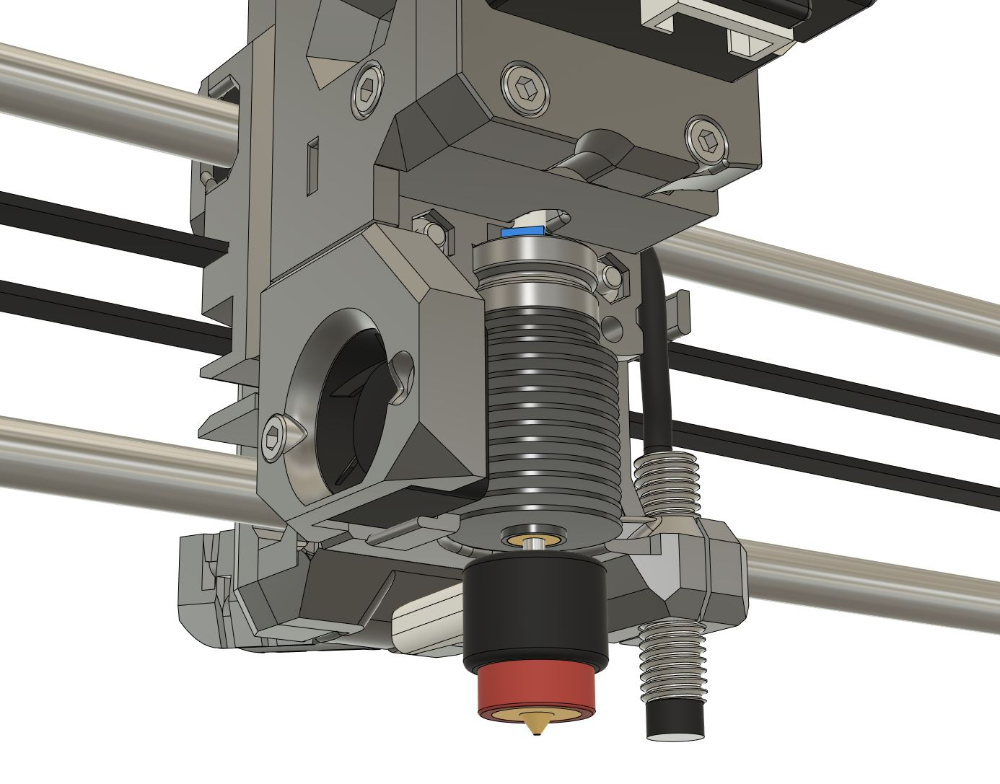
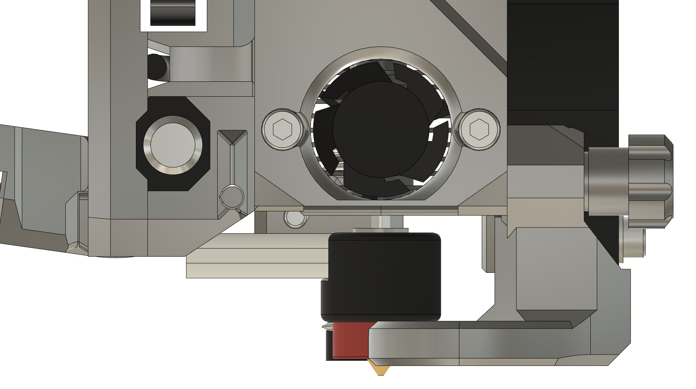
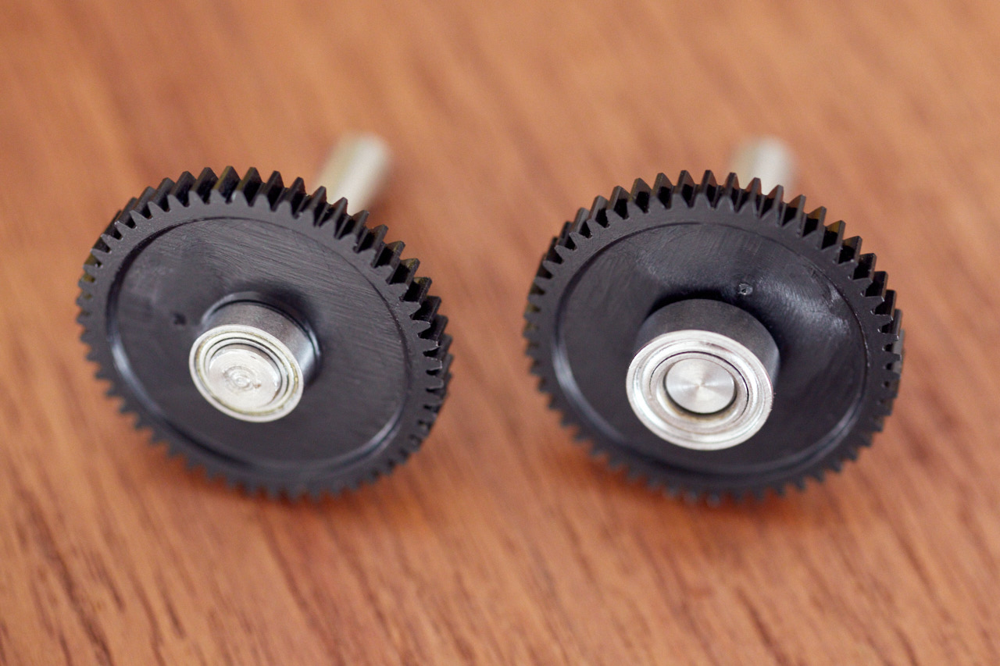
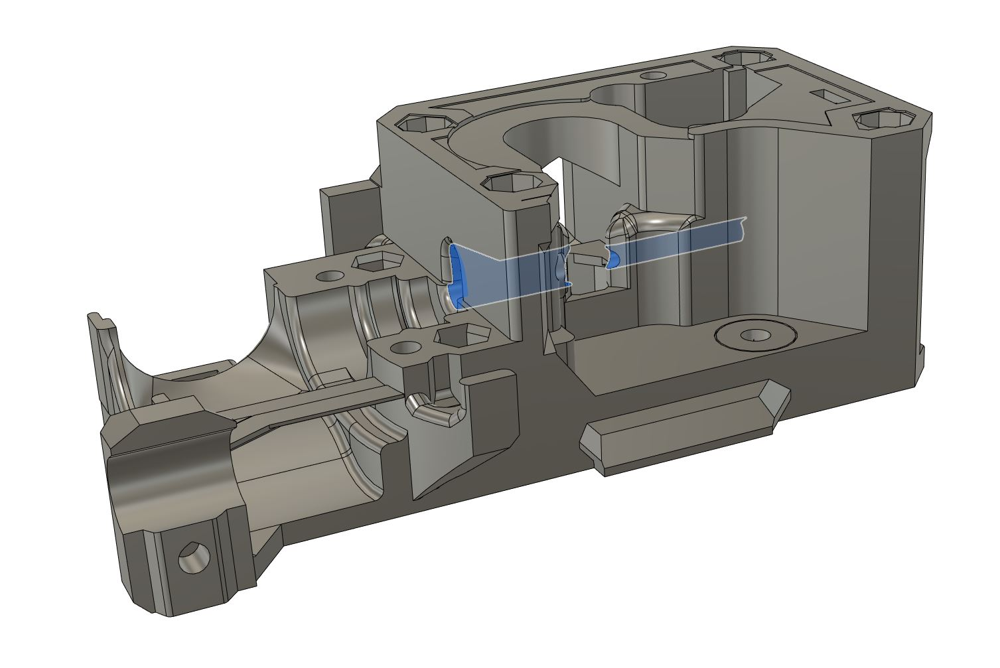
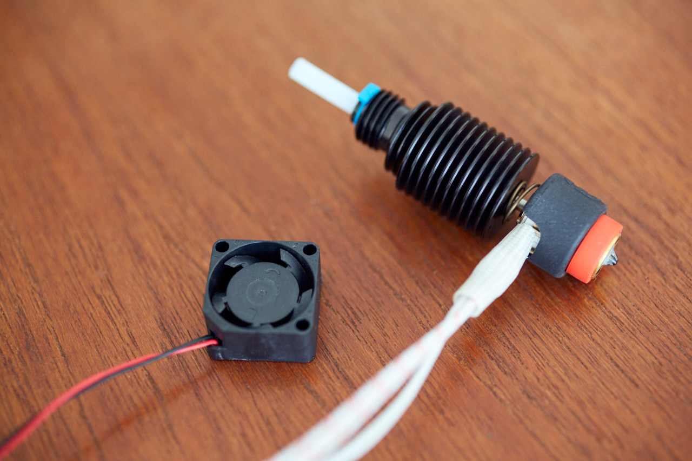
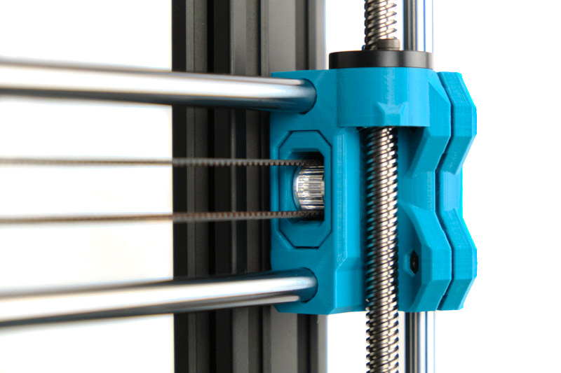
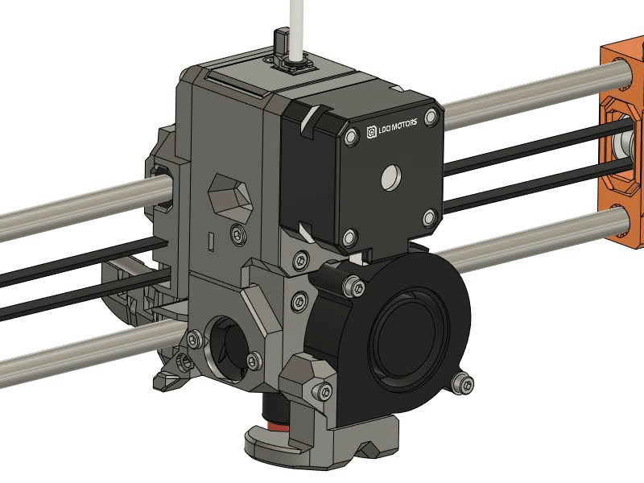
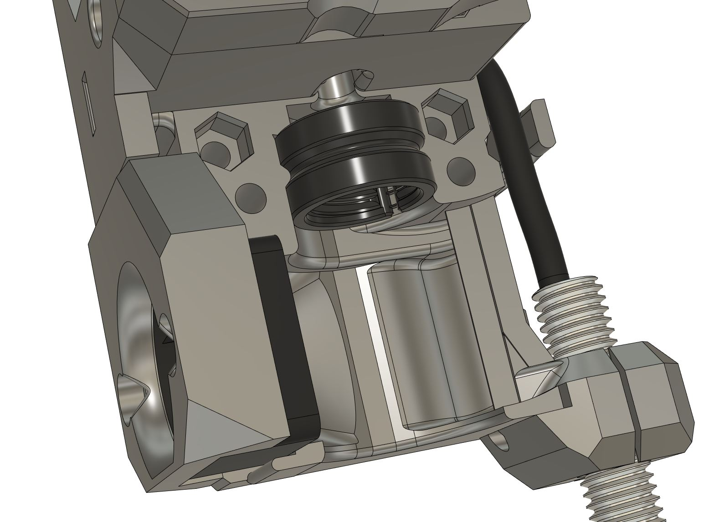
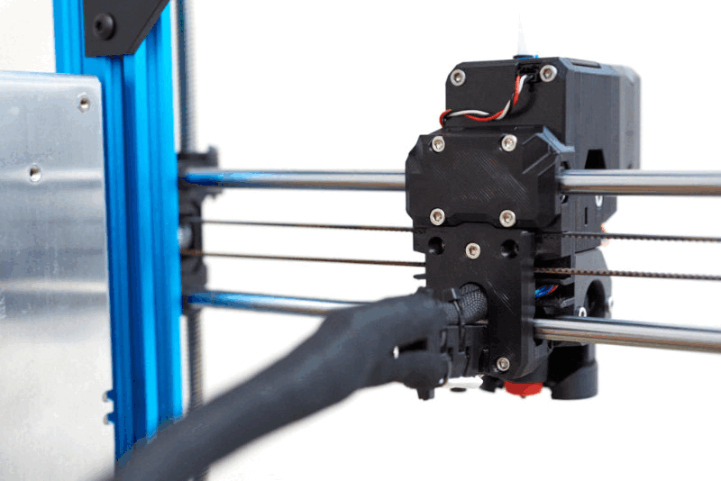

# BearExxa V2

## Design Goals

### Table of contents

1. [Introduction](#introduction)
1. [Print quality](#print-quality)
1. [Reliability](#reliability)
1. [Weight, rigidity and speed](#weight-rigidity-and-speed)
1. [Custom extruder motor](#custom-extruder-motor)
1. [Usability and maintenance](#usability-and-maintenance)
1. [FAQ](#faq)

### Introduction

The main goals of the BearExxa V2 are to use a better hotend and geared extruder to improve the print quality, reliability, usability, precision, speed and to solve inconsistent extrusion issue (602 issue).

### Print quality

This extruder improves print quality by using a geared extruder, a well engineered hotend and several design features. Here is how we have cured the 602 issue (inconsistent extrusion issue) as well as improving even further the print quality:

#### Random extrusion artifacts and accuracy

The first crucial aspect to get quality prints is to handle the filament precisely and rigidly down to the melt zone.

To achieve this we use a perfectly aligned, short and smooth filament path to reduce any potential friction. The path is shorter than on the original MK3S.

We use a NEMA 17 pancake motor to make sure the hobb gears and cavity stay cold even on long PLA prints in enclosure. 

We are also using the small set of the dual Bondtech hobb gears as its diameter allows to catch the filament going out of the hobb gears closer than with the larger gears. It reduces chances for the filament to go out of the path like it could happen with flexible filaments.

Then comes the hotend, we chose the heatsink and fan to have the sharpest transition possible in the heatbreak.

Furthermore, we made sure to have a free space right below the heatsink to cool this side with the movements of the tool head. It's important because the bottom side of the heatsink is where it matter the most to create a sharp heatbreak transition.

All these features **improve random extrusion artifacts and increase the accuracy** of your prints.

#### Repetitive extrusion artifacts

The extruder uses a gear ratio of 3:1 (with beta release) or almost 4:1 (with the future final release). 

We took care of using appropriate teeth numbers to have a smooth rotation and to reduce the wear on the teeth (e.g. coprime number of teeth, no profile shifting, hardened teeth, etc.). We believe that the print quality should be the same even after many hours of use!

The custom motor has enough torque to be sure that when the pressure increases in the hotend due to small issue or non-optimal settings (wider extrusion, partial clog, too high flow rate, ...) we don't make the motor steps too visible. This custom motor has a very concentric gear that will reduce variations in the rotation. For the final release we are also planning to use the all in one piece Bondtech shaft and hobb gear (IDGA) to once again reduce the variations.

All those features **improve the so called "moiré pattern" (also called basket wave or wood grain pattern)** or, in other words, the repetitive extrusion artifacts.

#### Single vs dual hobb gears

Finally, we have made several tests comparing single vs dual gears and we couldn't see a difference. We also asked the Bear community to test on their side and they had the same conclusion.

We understand there is a gear meshing issue but we think it can potentially only happen during retraction or maybe the artifacts are too small to be visible.

We also think that some of our design decisions are potentially helping to minimise this issue (rigid extruder cavity, tight tolerances to align the gears, good amount of tension with visible indicator, precise filament path, etc.).

We may later provide a mod to use a single gear for making your own conclusion. We are keeping an eye on this topic and for now we haven't seen good enough testing proving there is a noticeable difference.

### Reliability

Reliability is a strong goal of this extruder. We use a NEMA 17 pancake motor to keep the hobb gears and the extruder cavity as cold as possible during extensive PLA prints in enclosure (door closed).

After multiple testing with belts and planetary gears we found that a single stage of spur gears is the best compromise. It's light, easy to assemble and has a very low part count, which means less parts can fail.

We use the Bondtech gear shaft and hobb gears, but we replaced the original bearings by larger ones to increase lifespan (and smoothness).

We use the E3D Revo Micro hotend for its professional support and compliances with worldwide regulations. We optimized the hotend airflow for the best heatbreak performance possible, low noise and to avoid grabbing tiny hairs (strings).

We placed the nozzle fan blower in vertical to maximise the lifespan of its bearings, to not get warmer air when the extruder is close to the bed and, once again, to avoid getting strings in the fan blades.

Unlike the Original Prusa MK3S extruder, the filament path is in one piece to avoid a potential misalignment during assembly that would affect its smoothness. It is also shorter than MK3S extruder.

Every printed parts and features have been tested carefully. When rigidity or brittleness could be affected we made internal reinforcements within the infill to reduce any risks.

We also make sure that no special adjustments or tools are required during the assembly and maintenance. With the final release, we will provide detailed assembly guide, as we always do, to avoid any potential assembly issues.

### Weight, rigidity and speed

Despite a larger motor than what's commonly used these days, a lot of work have been implemented to make the extruder as light as possible, even lighter than some extruders widely used in the community! Let's dive into how we achieved this.

First it's important to remember that a bed slinger printer doesn't have to carry the weight of the gantry like on a CoreXY machine, which means the mass in motion is lighter than we could first think. However, obviously, the bed is heavy and will be the bottleneck.

On our design, we reduced the weight by using a light and small hotend (including the fan), using a single stage spur gears instead of heavier planetary gears, lowering the number of screws, using small hobb gears, carefully selecting the hardware, not adding extra useless features and designing a compact body.

As you can see we took care of every weight reduction that matters but we didn't stop there. The X axis is stiffer thanks to several design details: we use clamps on the Z axis bearings, X motor is closer to the Z axis, the belt tensioner is stiff and we optimized how deep the smooth rods are inserted in the X ends.

### Custom extruder motor

> [!WARNING]
> Not for the Beta release, will only be for RC and final releases.

The final release will use a custom extruder motor by LDO Motors. It was a difficult choice to take as we want to be as open hardware as possible but the improvements are significant.

This custom motor uses a carefully selected gear ratio for smoother print quality and  minimising teeth wear. It has a special construction to make the gear very concentric and so to reduce variations in extrusion. It also helps to reduce the total weight.

The back of the motor is almost empty inside, it has been made thicker to accommodate a connector. Like this, we reduce the maintenance time and so be quicker to restart printing.

Finally, the motor specs are optimized for original Prusa printers to provide a safe amount of torque on all occasions as well as keeping the motor cold. We chose a motor that has just enough torque to grind the filament in case of a blockage. This is to avoid problems where the spool or the filament path has lots of friction (didn't we all have a failed print due to this?), to fight slightly wrong settings that could force on the hotend's flow or, to resolve a small heat creep or, why not to later automate things like cold pulls. We believe that a finished print is always better than a failed one that will be sent to trash (even if the quality is a bit below what you wanted to achieve).

### Usability and maintenance

Thanks to the E3D Revo ecosystem you can swap nozzles with two fingers in a few seconds. And to make this even easier, you can remove the hotend fan duct with a thumb screw.

The hobb gear tension has a visual adjustment for the nominal tension.

The belt tensioner is easy to use and has a long adjustment range.

You only need to remove 4 screws to access all gears for easy cleaning and maintenance. The extruder motor also has a very accessible connector.

The E3D Revo Micro heatsink has a self tightening groove mount that block any rotation. Like this you will never have issue when swapping nozzles.

The back of the X carriage id.ade into two parts toaccess all the wiring and the belt freely.

### FAQ

#### Why don't you use heat inserts?
Hex or square nuts have a stronger pulling resistance than heat insert. We use carefully selected clearances to make sure the hex nuts will not move from their pocket. The nuts also take less place than heat insert. We can also simulate a lock nut by making the screw hole in the plastic a little bit smaller. It's easier to remove them from an older part to transfer them to a new one. Finally, no special tool is required.

#### Why the nozzle fan blower is in vertical and not angled like Prusa does?
It's to increase the lifespan of its bearings, to not get warmer air when we are close to the bed and to not grab strings with the fan blades. The nozzle fan duct is optimized for the 90° angle and perform better than the Original MK3(s) according to our tests.

#### Why do you recommend PETG?
PETG has an excellent layer bonding, is easy to print, has high precision due to low shrinkage, is semi fire retardant and produces less nasty fumes. Its temperature resistance is more toward printing PLA or PETG (even in enclosure) which are the most used filaments in the community. If you are an advanced user that want to print higher temperature material we recommend to use ABS, ASA or PC (and compensate for the shrinkage).

> [!CAUTION]
> We highly recommend to avoid high flow filaments (worse material properties as non high flow) as well as glass fibers or carbon fiber filaments (potentially carcinogenic, read more [here](https://hackaday.com/2024/08/07/on-carbon-fiber-types-and-their-carcinogenic-risks/)).

#### Why don't you use a smaller extruder motor?
We have explained the reason in details in the sections "Print quality", "Reliability" and "Weight, rigidity and speed".

The extra weight is compensated by other lighter parts, low hardware count and an overall compact design. Also, it would be very hard to see a print quality improvement with a lighter motor because, on a bed slinger, we are only moving the extruder (unlike CoreXY which also moves the gantry) and the bed is the heaviest part. 

However, a larger motor can run colder and so improve print quality and reliability of a long PLA print in an enclosure. Finally, we can also have higher torque and increase the gears' lifespan, which both increase reliability and reduce maintenance.

#### Why do you use the Revo Micro heatsink and not the Revo Voron heatsink?
The Revo Micro heatsink has slightly more surface in contact with the airflow, especially when used with a smaller and lighter fan. The round shape is also easier to optimize for optimal airflow. The screw mount may sound like it may rotate but we did a self tightening system that avoid this to happen.

#### Why don't you officially support other hotends?
Using a single hotend allow us to optimize a lot of design's aspects like size, weight, filament path, etc. Supporting a single hotend means we can also have a more reliable testing and provide quality support. Finally, we choose E3D-Online Ltd. because their products have all the worldwide safety compliances, they provide a full ecosystem, they made deep research and engineering on how a hotend works and they have a professional support for their customers.

#### Why don't you use the Bondtech IDGA gear?
We are well aware of the IDGA benefits. We have actually talked about it with Bondtech engineers several years ago when the Bondtech Prusa extruder was introduced and more recently for the development of the IDGA. We also thought to design our own gears as we see improvements but making a custom motor was already a big step.

When we released the beta BearExxa V2, the IDGA gear was unfortunately not available and so it's not supported yet. We will make the final version compatible with BMG IDGA or OEM IDGA (we don't know which one is best yet). However, we can guarantee that even without the IDGA the print quality is a big step over BearExxa V1 and 602 pattern (moiré, wood grain. inconsistency) has been drastically reduced.
