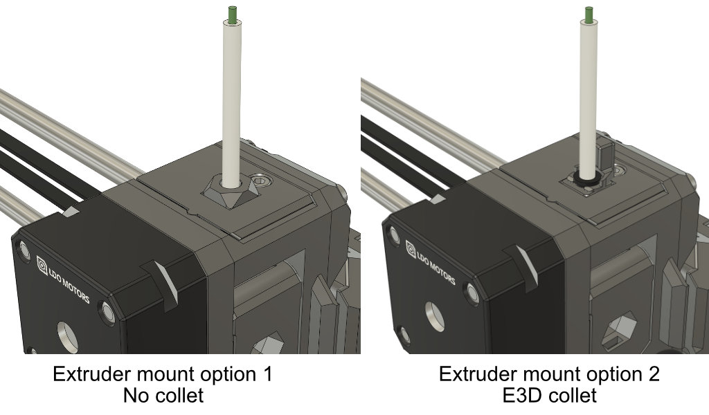

# BearExxa V2

## Reverse bowden adapter

### Introduction

Reverse bowden has the advantage to reduce vibration and tension from the spool holder. It is also useful to guide the filament if the spool holder is not on top of the frame.

The extruder adapter is available in two options:
  - no collet where PTFE is just pushed into the hole (enough holding in most cases, easy to use and light)
  - E3D collet when strong PTFE holding is needed

The frame mount is available in two versions: standard or angled.

### Bill of Materials

| Part                               | Quantity | Comment | Link |
|------------------------------------|:--------:|---------|------|
| PTFE tube 4x2mm                    |     1    |         |      |
| E3D bowden collet for metal 1.75mm |     1    | Only for extruder option 2 | [E3D store](https://e3d-online.com/products/embedded-bowden-coupling-for-metal) |
| PC4-M10 fitting                    |     2    | For the frame mount        |  |

### Printed parts

Download all optional parts with the button at [Repo Homepage -> Optional Printed Parts -> Official printed parts](/README.md#official-optional-parts)

## Print settings

> [!WARNING]
> The parts have been designed and tested with the parameters below and it is important to follow them to avoid issues like part cracking, bad bridging, not enough stiffness or wrong tolerances. You must [**calibrate your extrusion multiplier**](https://guides.bear-lab.com/Guide/Extrusion+multiplier+and+filament+diameter/8?lang=en) before printing the parts.

You can use the default PrusaSlicer print profile *0.20mm QUALITY @MK3* with 4 perimeters and 5 tops/bottoms layers and 20% infill. Otherwise, here are the parameters we recommend:

  * Slicer : PrusaSlicer
  * Nozzle size : 0.4mm
  * Layer height : 0.2mm
  * Infill : 20% Cubic or 20% Gyroid
  * Number of perimeters : 4
  * Number of top/bottom layers : 5
  * Default extrusion width : 0.45mm
  * Perimeters width : 0.45mm
  * External perimeters width : 0.45mm
  * Support : No
  * Brim : No
  * Detect thin walls : No

### Filament type

The parts are designed for PETG and this is what we recommend. Please consider recycled filament and cardboard spool or masterspool. If you are using a different filament material you will need to account for the shrinkage in XY plane directly in the slicer.

| Part                               | Quantity |    Filament    | Color | Comment                     |
|------------------------------------|:--------:|:--------------:|:-----:|-----------------------------|
| e_fs_adapter_rev_bowden_no_collet  |     1    |      PETG      |  Any  | For extruder mount option 1 |
| e_fs_adapter_rev_bowden_e3d_collet |     1    |      PETG      |  Any  | For extruder mount option 2 |
| e3d_collet_clip                    |     1    |      PETG      |  Any  | For extruder mount option 2 |
| frame_mount_standard               |     1    |      PETG      |  Any  | For frame mount option 1    |
| frame_mount_angled                 |     1    |      PETG      |  Any  | For frame mount option 2    |

### Assembly

1. Remove the filament from the extruder
2. Unscrew the filament sensor cover and the filament sensor PCB.
3. Remove the e_fs_adapter and the steel ball. Place the ball in the new e_fs_adapter_bowden and insert both in the extruder body (move the filament sensor lever to help with the insertion)
4. If you use the extruder mount option 2, insert the E3D collet into the printed part e_fs_adapter_rev_bowden_e3d_collet
5. Screw back the filament sensor PCB and cover
6. Thread the PC4-M10 fittings in the frame mount of your choice
7. Attach the frame mount to the frame
8. Cut the PTFE at the desired length
9. Insert one side of the PTFE tube inside the extruder mount printed part
10. If you use the extruder mount option 2, lock the PTFE tube with the 3D printed e3d_collet_clip
11. Insert the other side of the PTFE tube inside the PC4-M10

### CAD Files

The native CAD (Fusion) and STEP files are available at [`/cad/optional_parts`](/cad/optional_parts)